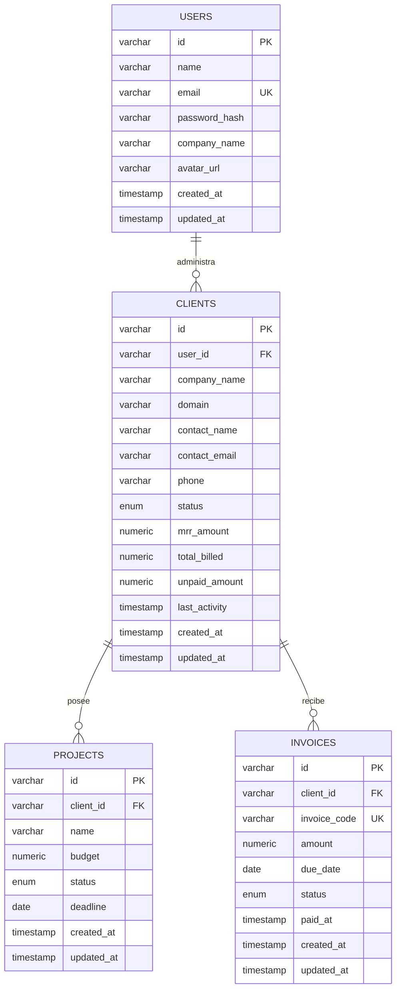

# ClientPulse — Plataforma SaaS B2B Single-Tenant para Gestión de Clientes, Proyectos y Facturación

[](https://react.dev/)
[](https://www.typescriptlang.org/)
[](https://tailwindcss.com/)
[](https://recharts.org/)
[](https://www.postgresql.org/)
[](https://www.prisma.io/)
[](https://vitest.dev/)
[](https://oxc.rs/)
[](LICENSE)

> **Proyecto 14 del Portafolio Profesional** — Plataforma SaaS Single-Tenant de analítica comercial, administración de contratos de clientes, entregables de proyectos y facturación automatizada para agencias digitales y consultorías B2B. Construido bajo la metodología **FORGE-DEV**.

---

## 🌟 Visión General & Propuesta de Valor

**ClientPulse** resuelve la fragmentación operativa en agencias y consultorías de tecnología centralizando en un único panel de control:
- El seguimiento del **MRR (Monthly Recurring Revenue)** y facturación puntual (*One-time*).
- La gestión de cuentas de clientes B2B con métricas de solvencia y balances pendientes.
- El control de entregables y avance de proyectos según presupuesto asignado.
- La emisión de facturas y conciliación de cobros en tiempo real.

---

## ✨ Características Principales

1. **🎨 Estética Luxury B2B Dark Mode:**
   - Paleta cromática refinada con fondo Midnight Slate (`#090D16`), tarjetas translúcidas con Glassmorphism (`#101726`), acentos en Índigo Eléctrico (`#6366F1`) y Esmeralda (`#10B981`).
   - Tipografía moderna con *Plus Jakarta Sans* e *Inter*.

2. **📊 Dashboard Ejecutivo & Analítica Visual:**
   - **4 KPI Cards:** MRR (`$24,850 +18.4%`), Clientes Activos (`42 +12.5%`), Proyectos Abiertos (`18 +5.9%`) e Invoices Pendientes (`$4,200 +8.7%`) con curvas sparklines SVG integradas.
   - **Billing Overview:** Gráfico de área reactivo (*Recharts AreaChart*) que compara ingresos recurrentes vs facturación por proyectos con exportación a CSV y tooltip temático.
   - **Projects by Status:** Gráfico de rosca (*Donut Chart*) con distribución porcentual de proyectos (*In Progress, On Hold, Planning, Completed*).

3. **👥 Módulo de Clientes (Recent Clients):**
   - Tabla analítica con avatares con gradiente por iniciales, enlaces de dominio, contador de proyectos, MRR, facturación total, balances impagos y menú de acciones rápidas.
   - Modal de registro de cliente con validación en tiempo real mediante **Zod** (`src/schemas/clientSchema.ts`).
   - Modal de detalle 360º de cuenta (`ClientDetailModal.tsx`) con historial cruzado de proyectos y cobros.

4. **📁 Módulo de Proyectos (Deliverables & Milestones):**
   - Tarjetas de proyectos con barras de progreso animadas, asignación presupuestaria (`$28,000`), fecha límite y avance de etapa con 1 clic.
   - Modal de creación de proyectos vinculado a clientes activos (`NewProjectModal.tsx`).

5. **🧾 Módulo de Facturación & Invoices:**
   - Indicadores de estado de cuenta (*Total Facturado, Cobrado, Pendiente y Vencido*).
   - Tabla de facturas con badges de cobro (*Paid, Unpaid, Overdue*), acción `Mark Paid` con conciliación inmediata del balance del cliente y descarga de recibo digital estructurado.
   - Modal de emisión con código correlativo (`INV-2025-XXX`).

6. **🔒 Infraestructura Single-Tenant & Base de Datos:**
   - Contenedor oficial **PostgreSQL 17** en Docker Compose (`compose.yaml`) con volúmenes persistentes y healthcheck.
   - Modelado relacional completo con **Prisma 6** (`prisma/schema.prisma`).

---

## 🏛️ Arquitectura del Proyecto

```text
14-mini-saas/
├── .github/
│   └── workflows/
│       └── ci.yml               # Pipeline de CI (Lint, Test, Build)
├── database/
│   ├── schema.sql               # DDL PostgreSQL 17
│   ├── seed.sql                 # Datos determinísticos de prueba
│   └── README.md                # Diagrama DER Mermaid y diccionario
├── design/
│   ├── PROMPTS.md               # Prompts de generación para IA visual
│   └── design.png               # Mockup visual de referencia
├── prisma/
│   └── schema.prisma            # Schema Prisma 6 con índices y cascadas
├── src/
│   ├── components/
│   │   ├── clients/
│   │   │   ├── ClientDetailModal.tsx
│   │   │   ├── NewClientModal.tsx
│   │   │   └── RecentClientsTable.tsx
│   │   ├── dashboard/
│   │   │   ├── BillingOverviewChart.tsx
│   │   │   ├── ExecutiveDashboard.tsx
│   │   │   ├── KpiMetricCard.tsx
│   │   │   └── ProjectsStatusDonut.tsx
│   │   ├── invoices/
│   │   │   ├── InvoicesView.tsx
│   │   │   └── NewInvoiceModal.tsx
│   │   ├── layout/
│   │   │   ├── AppShell.tsx
│   │   │   ├── Sidebar.tsx
│   │   │   └── Topbar.tsx
│   │   └── projects/
│   │       ├── NewProjectModal.tsx
│   │       └── ProjectsView.tsx
│   ├── data/
│   │   └── mockSaaSData.ts      # Fixtures del dominio
│   ├── schemas/
│   │   ├── clientSchema.ts      # Esquemas Zod para clientes
│   │   ├── invoiceSchema.ts     # Esquemas Zod para facturas
│   │   └── projectSchema.ts     # Esquemas Zod para proyectos
│   ├── stores/
│   │   └── useSaaSStore.ts      # Store global Zustand 5
│   ├── tests/                   # Pruebas de integración y accesibilidad
│   ├── types/
│   │   └── saas.ts              # Interfaces TypeScript
│   ├── App.tsx
│   ├── index.css
│   └── main.tsx
├── compose.yaml                 # Docker Compose PostgreSQL 17
├── package.json
├── tsconfig.json
└── vite.config.ts
```

---

## 📊 Diagrama Entidad-Relación (PostgreSQL 17 / Prisma 6)



---

## 🚀 Instalación y Puesta en Marcha

### Prerrequisitos
- Node.js `>= 22.0.0`
- npm `>= 10.0.0`
- Docker & Docker Compose (opcional para levantar la base de datos PostgreSQL)

### Pasos

1. **Clonar el repositorio:**
   ```bash
   git clone https://github.com/alxnrocha/mini-saas.git
   cd mini-saas
   ```

2. **Instalar dependencias:**
   ```bash
   npm install
   ```

3. **Iniciar el contenedor de base de datos PostgreSQL 17 (Opcional):**
   ```bash
   docker compose up -d
   ```

4. **Ejecutar en modo desarrollo:**
   ```bash
   npm run dev
   ```
   Abrir [http://localhost:5173](http://localhost:5173) en el navegador.

5. **Ejecutar la suite de pruebas automatizadas (Vitest):**
   ```bash
   npm test
   ```

6. **Ejecutar el linter (Oxlint):**
   ```bash
   npm run lint
   ```

7. **Compilar el bundle de producción:**
   ```bash
   npm run build
   ```

---

## 🛡️ Calidad de Código & Testing

- **21 Pruebas Unitarias e Integración:** Cobertura de esquemas Zod, conciliación de facturas, ciclo de vida de clientes, avance de estados de proyectos y accesibilidad.
- **Oxlint:** Cero advertencias y cero errores en la totalidad del código fuente.
- **Accesibilidad (a11y):** Semántica ARIA completa (`role="dialog"`), cierre de diálogos con `Escape` y anillos de foco visibles.

---

## 📄 Licencia

Este proyecto se encuentra bajo la Licencia MIT. Consulta el archivo [LICENSE](LICENSE) para más detalles.
