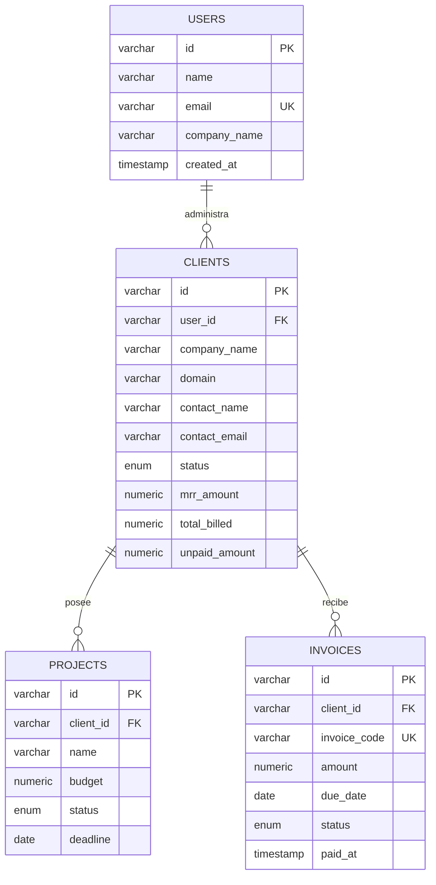

# ClientPulse — Plataforma SaaS B2B para Gestión de Clientes, Proyectos y Facturación

<div align="center">


**Plataforma SaaS B2B de analítica comercial, seguimiento de MRR, administración de cuentas de clientes, entregables de proyectos y conciliación automatizada de facturas para agencias y consultorías.**

[🚀 Demo en Vivo](https://alxnrocha.github.io/mini-saas/) • [📂 Repositorio en GitHub](https://github.com/alxnrocha/mini-saas)

</div>

---

## 🏛️ Arquitectura y Modelo de Datos



---

## ✨ Características Principales

1. **📊 Dashboard Ejecutivo & Analítica Visual:**
   - **4 KPI Cards:** MRR (`$24,850 +18.4%`), Clientes Activos (`42 +12.5%`), Proyectos Abiertos (`18 +5.9%`) e Invoices Pendientes (`$4,200 +8.7%`) con sparklines SVG.
   - **Billing Overview:** Gráfico de área reactivo (*Recharts AreaChart*) que compara ingresos recurrentes vs facturación por proyectos con exportación a CSV.
   - **Projects by Status:** Gráfico tipo Donut con distribución porcentual de proyectos (*In Progress, On Hold, Planning, Completed*).

2. **👥 Módulo de Clientes (Recent Clients):**
   - Tabla analítica con avatares de iniciales, enlaces de dominio, contador de proyectos, MRR, facturación total y balances impagos.
   - Modal de registro de cliente con validación en tiempo real mediante **Zod**.
   - Modal de detalle 360º de cuenta con historial cruzado de proyectos y cobros.

3. **📁 Módulo de Proyectos (Deliverables & Milestones):**
   - Tarjetas de proyectos con barras de progreso animadas, asignación presupuestaria (`$28,000`), fecha límite y avance de etapa con 1 clic.

4. **🧾 Módulo de Facturación & Invoices:**
   - Indicadores de estado de cuenta (*Total Facturado, Cobrado, Pendiente y Vencido*).
   - Tabla de facturas con badges de cobro (*Paid, Unpaid, Overdue*), acción `Mark Paid` con conciliación inmediata del balance del cliente y descarga de recibo digital estructurado.

---

## 🗂️ Estructura del Proyecto

```text
14-mini-saas/
├── database/
│   ├── schema.sql               # DDL PostgreSQL 17
│   └── seed.sql                 # Datos determinísticos de prueba
├── prisma/
│   └── schema.prisma            # Schema Prisma 6 con índices y cascadas
├── src/
│   ├── components/              # clients, dashboard, invoices, layout, projects
│   ├── data/                    # Fixtures del dominio
│   ├── schemas/                 # Esquemas Zod para clientes, facturas y proyectos
│   ├── stores/                  # Store global Zustand 5
│   ├── types/                   # Interfaces TypeScript
│   ├── App.tsx
│   └── main.tsx
├── tests/                       # 21 pruebas unitarias e integración con Vitest
├── compose.yaml                 # Docker Compose PostgreSQL 17
├── package.json
├── tsconfig.json
└── vite.config.ts
```

---

## 🚀 Instalación y Puesta en Marcha

### Prerrequisitos
- Node.js `>= 20.0.0`
- npm `>= 10.0.0`
- Docker & Docker Compose (opcional para PostgreSQL)

### Ejecución Local
```bash
# 1. Clonar el repositorio
git clone https://github.com/alxnrocha/mini-saas.git
cd mini-saas

# 2. Instalar dependencias
npm install

# 3. Iniciar contenedor de base de datos (opcional)
docker compose up -d

# 4. Iniciar servidor de desarrollo
npm run dev

# 5. Ejecutar suite de pruebas unitarias (21 tests)
npm test

# 6. Compilar para producción
npm run build
```

---

## 🛠️ Tecnologías Utilizadas

| Capa | Tecnología | Aspectos Clave |
|---|---|---|
| **Framework** | React 19 | Arquitectura modular desacoplada por dominios |
| **Lenguaje** | TypeScript 5.8 | Tipado estricto para entidades SaaS y DTOs |
| **Base de Datos** | PostgreSQL 17, Prisma 6 | Modelado relacional completo, DDL nativo |
| **Estado Global** | Zustand 5.0 | Gestión reactiva de facturas, clientes y proyectos |
| **Validación** | Zod 3.24 | Esquemas de validación de formularios |
| **Visualización** | Recharts 2.15 | Gráficos de área de facturación y donut de proyectos |
| **Testing** | Vitest | 21 pruebas unitarias y de integración |
| **Despliegue** | GitHub Pages | Despliegue estático continuo y optimizado |

---

<div align="center">
  <sub>Desarrollado con dedicación por <a href="https://github.com/alxnrocha">Alex Rocha</a> • Proyecto 14 del Portafolio Profesional Frontend.</sub>
</div>
