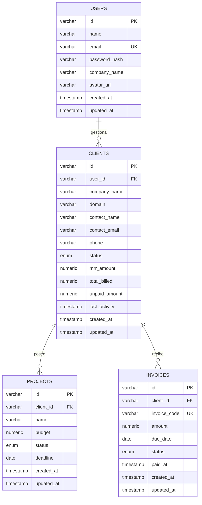

# Documentación de Base de Datos — ClientPulse SaaS (PostgreSQL 17)

Arquitectura relacional diseñada para soportar gestión de cuentas de clientes B2B, asignación de proyectos y emisión de facturas/invoices en modelo Single-Tenant.

---

## 📊 Diagrama Entidad-Relación (DER)



---

## 🗃️ Diccionario de Datos

| Tabla | Propósito | Llave Primaria | Relaciones / Restricciones |
| :--- | :--- | :--- | :--- |
| `users` | Cuentas administrativas del SaaS | `id` (VARCHAR) | `email` único |
| `clients` | Empresas y cuentas B2B | `id` (VARCHAR) | FK `user_id` -> `users.id` (ON DELETE CASCADE) |
| `projects` | Proyectos contratados y presupuestos | `id` (VARCHAR) | FK `client_id` -> `clients.id` (ON DELETE CASCADE) |
| `invoices` | Facturas emitidas y estado de cobro | `id` (VARCHAR) | FK `client_id` -> `clients.id`, `invoice_code` único |

---

## 🐳 Ejecución con Docker Compose

Para iniciar la base de datos PostgreSQL 17 en local:

```bash
docker compose up -d
```

Para aplicar las migraciones con Prisma 6:

```bash
npx prisma migrate dev --name init
```
